# Wanderlust Mega Project 🚀

End-to-end deployment of a **three-tier MERN application on AWS EKS** using Jenkins CI/CD, DevSecOps security checks, GitOps with Argo CD, and Kubernetes monitoring.

## Project Deployment Workflow


**GitHub → Jenkins CI → OWASP → SonarQube → Trivy → Docker → Docker Hub → Jenkins CD → GitHub → Argo CD → AWS EKS → Prometheus/Grafana**

## Repository Structure

```text
Wanderlust-Mega-Project/
├── Assets/
│   └── DevSecOps+GitOps.gif
├── Automations/
├── GitOps/
├── backend/
├── database/
├── frontend/
├── kubernetes/
├── terraform/
├── screenshots/
├── Jenkinsfile
├── docker-compose.yml
├── package.json
├── package-lock.json
└── README.md
```

## Technology Stack

| Category | Tools |
|---|---|
| Source Control | GitHub |
| CI/CD | Jenkins |
| Pipeline Reuse | Jenkins Shared Library |
| Code Quality | SonarQube |
| Dependency Security | OWASP Dependency-Check |
| Security Scanning | Trivy |
| Containerization | Docker |
| Image Registry | Docker Hub |
| Cloud | AWS |
| Kubernetes | Amazon EKS |
| Cluster Provisioning | eksctl |
| GitOps | Argo CD |
| Package Management | Helm |
| Monitoring | Prometheus, Grafana |
| Application Cache | Redis |

## Implementation Steps

### 1. AWS EC2 & Jenkins Master Setup

Provisioned an Ubuntu EC2 instance and used it as the **Jenkins master/controller and primary automation machine**. No separate Jenkins worker/agent node was used.

Installed Docker:

```bash
sudo apt-get update
sudo apt-get install docker.io -y
sudo usermod -aG docker ubuntu
newgrp docker
```

Installed Java and Jenkins:

```bash
sudo apt update -y
sudo apt install fontconfig openjdk-17-jre -y

sudo wget -O /usr/share/keyrings/jenkins-keyring.asc \
  https://pkg.jenkins.io/debian-stable/jenkins.io-2023.key

echo "deb [signed-by=/usr/share/keyrings/jenkins-keyring.asc]" \
  https://pkg.jenkins.io/debian-stable binary/ | \
  sudo tee /etc/apt/sources.list.d/jenkins.list > /dev/null

sudo apt-get update -y
sudo apt-get install jenkins -y
```

Jenkins was configured on port `8080` along with the required plugins, credentials and integrations.

---

### 2. AWS CLI Setup

Installed AWS CLI on the Jenkins master and configured AWS credentials:

```bash
curl "https://awscli.amazonaws.com/awscli-exe-linux-x86_64.zip" -o "awscliv2.zip"
sudo apt install unzip -y
unzip awscliv2.zip
sudo ./aws/install
aws configure
```

Verify:

```bash
aws --version
```

---

### 3. kubectl Setup

Installed and configured `kubectl` on the Jenkins master for Kubernetes administration:

```bash
kubectl version --client
```

---

### 4. eksctl Setup

Installed `eksctl` for EKS cluster provisioning:

```bash
curl --silent --location \
  "https://github.com/weaveworks/eksctl/releases/latest/download/eksctl_$(uname -s)_amd64.tar.gz" \
  | tar xz -C /tmp

sudo mv /tmp/eksctl /usr/local/bin
eksctl version
```

---

### 5. AWS EKS Cluster & Node Group

Created the EKS control plane from the Jenkins master without a node group initially:

```bash
eksctl create cluster \
  --name=wanderlust \
  --region=us-east-2 \
  --version=1.30 \
  --without-nodegroup
```

Associated the IAM OIDC provider:

```bash
eksctl utils associate-iam-oidc-provider \
  --region us-east-2 \
  --cluster wanderlust \
  --approve
```

Created the managed node group:

```bash
eksctl create nodegroup \
  --cluster=wanderlust \
  --region=us-east-2 \
  --name=wanderlust \
  --node-type=t2.large \
  --nodes=2 \
  --nodes-min=2 \
  --nodes-max=2 \
  --node-volume-size=29 \
  --ssh-access \
  --ssh-public-key=eks-nodegroup-key
```

Verified the cluster and workloads:

```bash
kubectl get nodes
kubectl get pods -A
```

---

### 6. SonarQube Setup

Ran SonarQube as a Docker container on the Jenkins master:

```bash
docker run -itd \
  --name SonarQube-Server \
  -p 9000:9000 \
  sonarqube:lts-community
```

Verified the container:

```bash
docker ps
```

Configured the SonarQube token, Jenkins credential, SonarQube Scanner and SonarQube server integration.

Configured the SonarQube webhook for Jenkins Quality Gate feedback.

---

### 7. OWASP Dependency-Check

Configured the Jenkins **OWASP Dependency-Check** plugin/tool and integrated dependency vulnerability scanning into the CI pipeline.

The scan checks application dependencies against known vulnerability data.

---

### 8. Trivy Security Scanner

Installed Trivy on the Jenkins master:

```bash
sudo apt-get install wget apt-transport-https gnupg lsb-release -y

wget -qO - https://aquasecurity.github.io/trivy-repo/deb/public.key \
  | sudo apt-key add -

echo deb https://aquasecurity.github.io/trivy-repo/deb \
  $(lsb_release -sc) main \
  | sudo tee -a /etc/apt/sources.list.d/trivy.list

sudo apt-get update -y
sudo apt-get install trivy -y
```

Trivy was integrated into the CI pipeline for filesystem/container security scanning.

---

### 9. Jenkins Shared Library

Created and configured a reusable Jenkins Shared Library:

**Repository:** `bhushanpatil251/jenkins-shared-libraries`

Configured it under:

**Jenkins → Manage Jenkins → System → Global Trusted Pipeline Libraries**

The shared library centralizes reusable Docker build, push and deployment functions and keeps the application Jenkinsfiles cleaner.

---

### 10. GitHub, Jenkins & Docker Hub Integration

Connected the application repository with Jenkins and configured the required GitHub credentials and webhook.

Configured Docker Hub credentials in Jenkins for authenticated image pushes.

The CI/CD flow was parameterized so backend and frontend Docker image versions can be passed between the CI and CD pipelines.

---

### 11. Jenkins CI Pipeline

Created the `Wanderlust-CI` pipeline.

The CI pipeline performs:

```text
GitHub Checkout
      ↓
OWASP Dependency-Check
      ↓
SonarQube Analysis
      ↓
Quality Gate
      ↓
Trivy Scan
      ↓
Docker Build
      ↓
Docker Hub Push
```

Backend and frontend Docker images are built with versioned tags and pushed to Docker Hub.

---

### 12. Jenkins CD Pipeline

Created the `Wanderlust-CD` pipeline.

After a successful CI build, the Docker image tags are passed to the CD pipeline. The deployment configuration is updated with the new image versions and the GitOps repository is updated for Argo CD synchronization.

---

### 13. Argo CD Installation & Configuration

Created the Argo CD namespace:

```bash
kubectl create namespace argocd
```

Installed Argo CD:

```bash
kubectl apply -n argocd \
  -f https://raw.githubusercontent.com/argoproj/argo-cd/stable/manifests/install.yaml
```

Verified the installation:

```bash
kubectl get pods -n argocd
kubectl get svc -n argocd
```

Installed the Argo CD CLI:

```bash
sudo curl --silent --location -o /usr/local/bin/argocd \
  https://github.com/argoproj/argo-cd/releases/download/v2.4.7/argocd-linux-amd64

sudo chmod +x /usr/local/bin/argocd
```

Changed the Argo CD server service to NodePort:

```bash
kubectl patch svc argocd-server \
  -n argocd \
  -p '{"spec": {"type": "NodePort"}}'
```

Retrieved the initial admin password:

```bash
kubectl -n argocd get secret argocd-initial-admin-secret \
  -o jsonpath="{.data.password}" | base64 -d; echo
```

Connected the Git repository in Argo CD, added the EKS cluster and created the application for GitOps-based deployment.

---

### 14. Deploy Application Through GitOps

The final application deployment flow:

```text
Jenkins CI
    ↓
Docker Hub
    ↓
Jenkins CD
    ↓
GitHub GitOps Repository
    ↓
Argo CD
    ↓
AWS EKS
```

Verified the deployed workloads:

```bash
kubectl get pods -A
kubectl get svc -A
```

---

### 15. Jenkins Email Notifications

Configured Jenkins SMTP/email notifications and credentials. The Jenkins master security group was configured for the required SMTP access.

Pipeline status notifications were enabled for CI/CD jobs.


---

### 16. Helm Installation

Installed Helm on the Jenkins master:

```bash
curl -fsSL -o get_helm.sh \
  https://raw.githubusercontent.com/helm/helm/main/scripts/get-helm-3

chmod 700 get_helm.sh
./get_helm.sh
```

Verified Helm:

```bash
helm version
```

Added the required Helm repositories:

```bash
helm repo add stable https://charts.helm.sh/stable
helm repo add prometheus-community https://prometheus-community.github.io/helm-charts
```

Updated and verified the repositories:

```bash
helm repo update
helm repo list
```

---

### 17. Prometheus & Grafana Monitoring

Created the monitoring namespace:

```bash
kubectl create namespace prometheus
```

Installed the `kube-prometheus-stack` chart from the Prometheus Community repository:

```bash
helm install stable \
  prometheus-community/kube-prometheus-stack \
  -n prometheus
```

Verified the monitoring components:

```bash
kubectl get pods -n prometheus
kubectl get svc -n prometheus
```

Exposed Prometheus and Grafana through NodePort services and verified the assigned ports.

Grafana credentials were retrieved from the Kubernetes secret:

```bash
kubectl get secret \
  --namespace prometheus stable-grafana \
  -o jsonpath="{.data.admin-password}" | base64 --decode; echo
```

Grafana username:

```text
admin
```

---

## Jenkins Pipeline Structure

### CI

```text
GitHub
  ↓
Checkout
  ↓
OWASP
  ↓
SonarQube
  ↓
Quality Gate
  ↓
Trivy
  ↓
Docker Build
  ↓
Docker Hub Push
```

### CD

```text
CI Success
  ↓
Image Tags
  ↓
Jenkins CD
  ↓
GitOps Repository Update
  ↓
Argo CD Sync
  ↓
AWS EKS
```

## Jenkins Shared Library

Reusable Jenkins pipeline functions are maintained separately:

**Jenkins Shared Libraries:**
https://github.com/bhushanpatil251/jenkins-shared-libraries

The Shared Library separates common pipeline logic from the application Jenkinsfile and improves pipeline maintainability and reuse.

## Implementation Snippets

The following implementation snippets provide evidence of the project setup, CI/CD execution, Kubernetes deployment, security configuration, and monitoring stages.

### 1. Infrastructure / Security Group
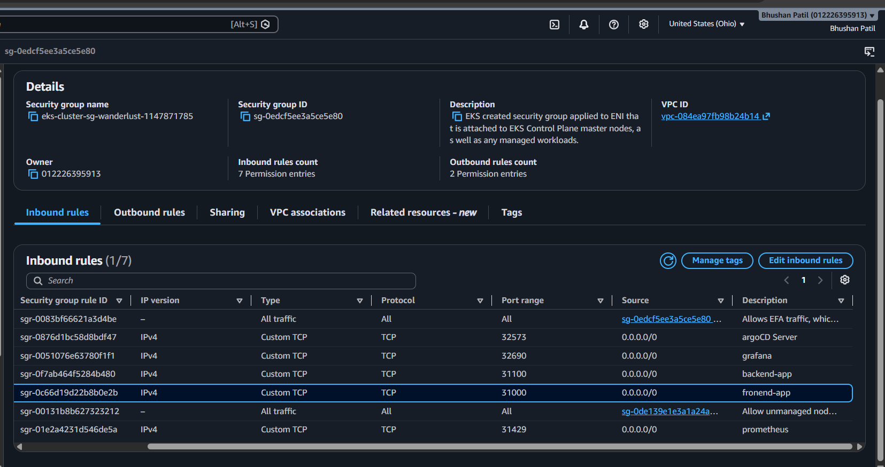

### 2. Kubernetes Nodes
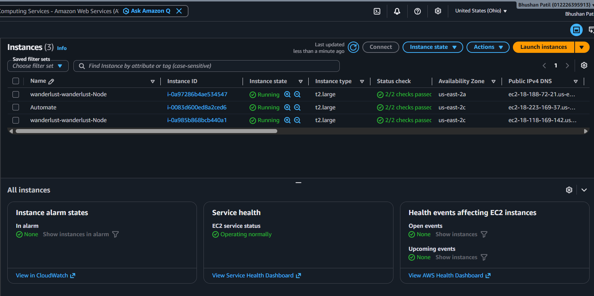

### 3. Kubernetes Nodes and Pods


### 4. CI Pipeline
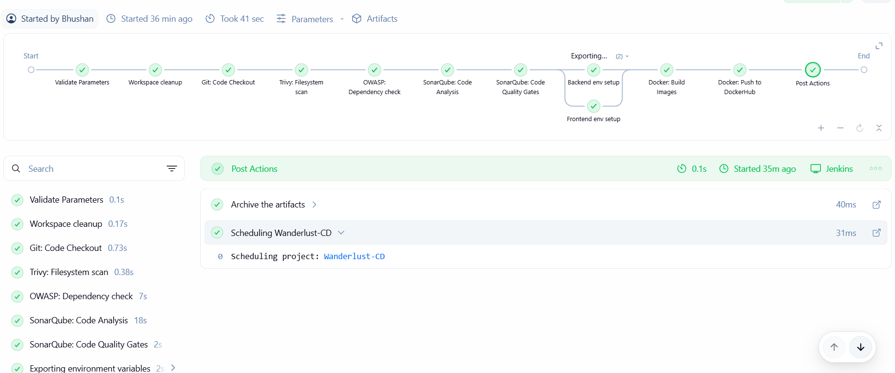

### 5. CI Pipeline - Blue Ocean
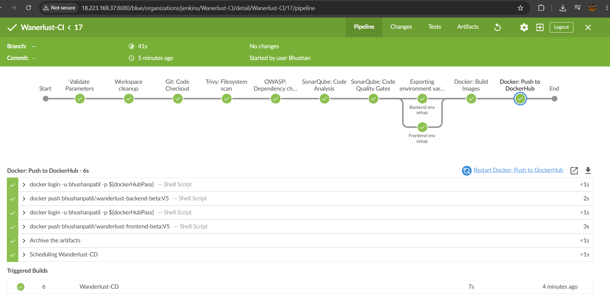

### 6. CD Pipeline
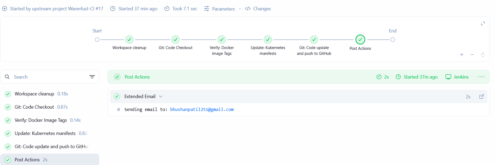

### 7. CD Pipeline - Blue Ocean
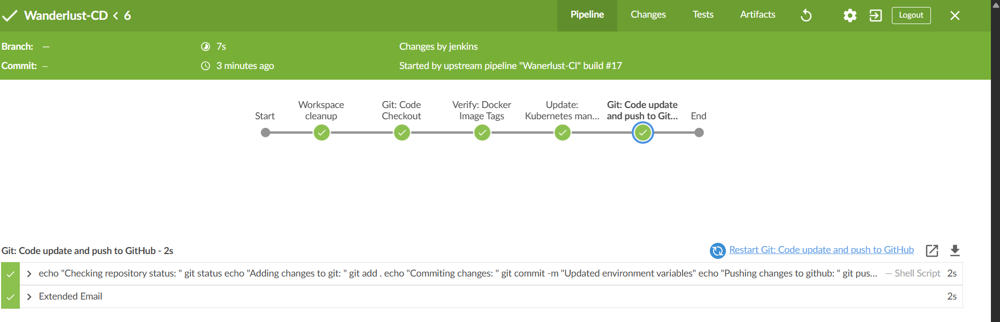

### 8. ArgoCD Deployment
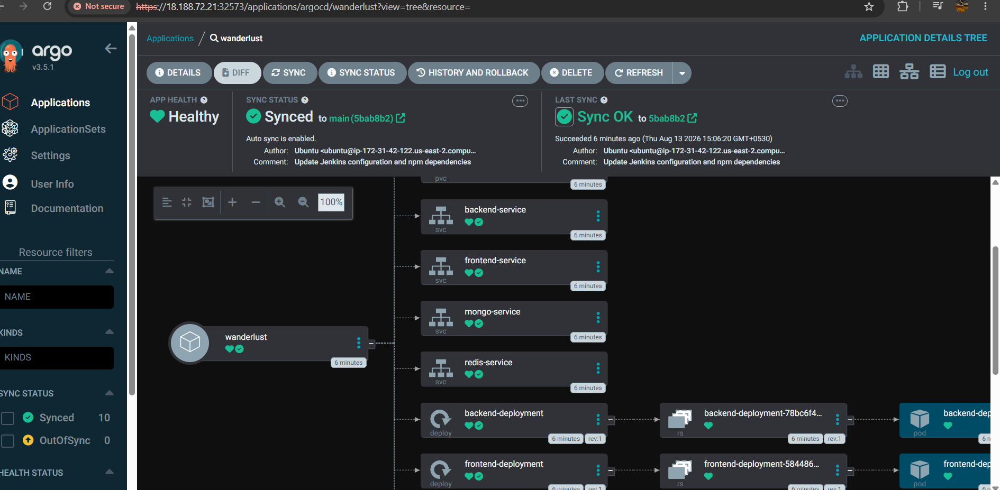

### 9. Prometheus
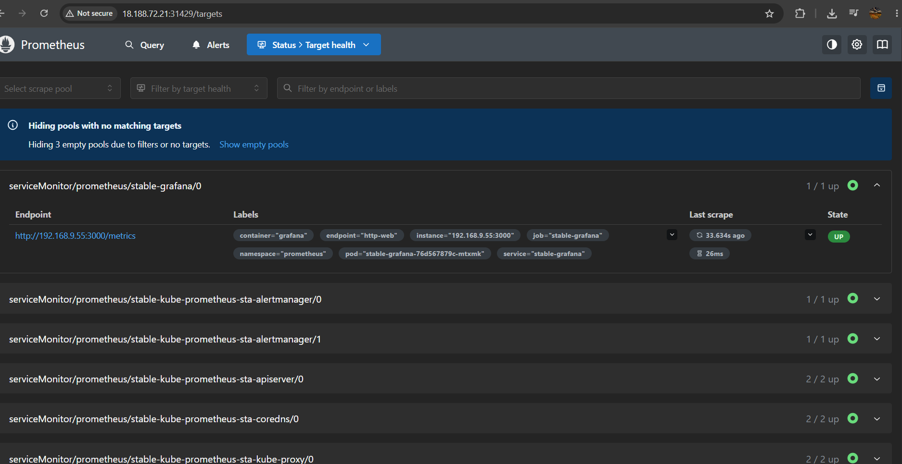

### 10. Grafana
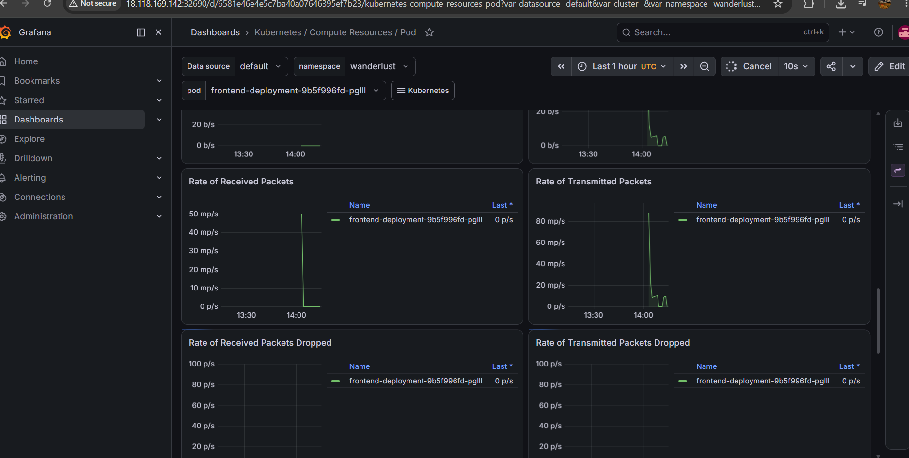

### 11. Application Deployment
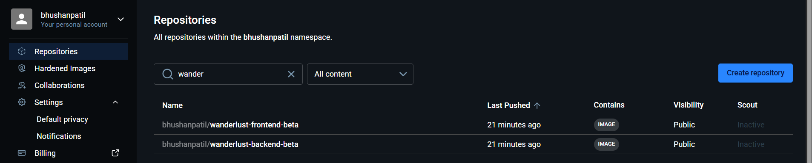

### 12. Notifications
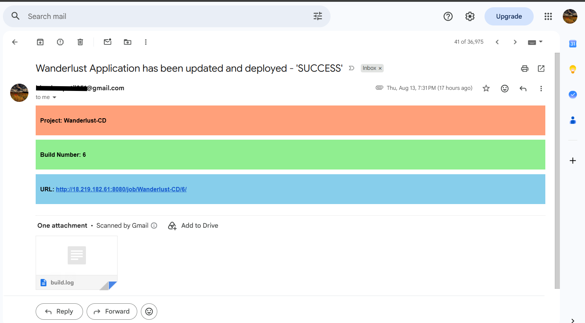

### 13. NVD API Key Configuration
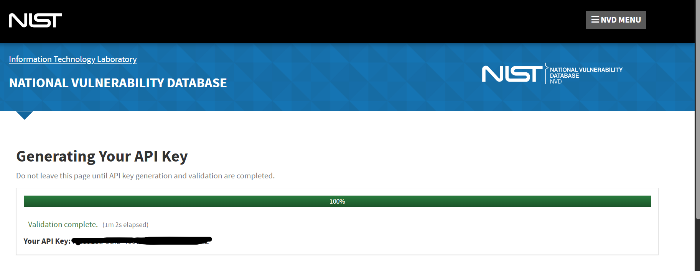

---

## Cleanup

When the environment is no longer required, remove the EKS cluster and its managed resources:

```bash
eksctl delete cluster --name=wanderlust --region=us-east-2
```
